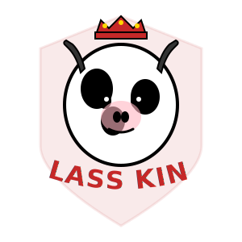

# CLASS KING Logo 设计说明

## 🎨 设计理念

CLASS KING 的 Logo 采用 **Retro American Varsity（美式复古校园风）** 设计，融合了力量、权威和亲和力。

---

## 📐 主 Logo 设计 (logo.svg)

### 核心元素

#### 1. 奶牛头部肖像
- **造型**：强壮、自信的卡通奶牛侧面肖像
- **表情**：坚定的微笑，带有一丝自信的"坏笑"
- **细节**：
  - 尖锐的牛角（象征力量和决断）
  - 黑白斑点（经典奶牛特征）
  - 粉色鼻子（增加亲和力）
  - 炯炯有神的眼睛（展现智慧）

#### 2. 朱红色皇冠 👑
- **位置**：戴在牛头顶部
- **颜色**：朱红色 (#C62828)
- **装饰**：金色宝石点缀
- **象征**：班长的权威和领导力

#### 3. 盾牌背景
- **形状**：抽象的盾形轮廓
- **颜色**：朱红色半透明 + 描边
- **作用**：增强复古校园风格，象征保护和责任

#### 4. 文字设计
- **字体**：Impact（美式复古经典字体）
- **排版**：弧形环绕在牛头下方
- **颜色**：朱红色填充 + 黑色描边
- **效果**：粗体、高对比度、易识别

### 配色方案

| 颜色 | 色值 | 用途 |
|------|------|------|
| 朱红色 | #C62828 | 主色调（皇冠、文字、盾牌）|
| 黑色 | #000000 | 轮廓、斑点、描边 |
| 白色 | #FFFFFF | 奶牛底色 |
| 金色 | #FFD700 | 皇冠宝石装饰 |
| 粉色 | #FFB6C1 | 鼻子（增加亲和力）|

### 复古效果

- **颗粒感**：使用 SVG filter 添加轻微的噪点纹理
- **斑驳效果**：模仿复古印刷的质感
- **高对比度**：黑白分明，符合美式复古风格

---

## 🔖 Favicon 设计 (favicon.svg)

### 极简化原则

Favicon 是主 Logo 的极简版本，专为 32x32px 小尺寸优化：

#### 保留元素
- ✅ 牛角（核心识别元素）
- ✅ 皇冠（品牌标志）
- ✅ 简化的头部轮廓

#### 移除元素
- ❌ 盾牌背景
- ❌ 文字（CLASS KING）
- ❌ 复杂细节（斑点、鼻子细节）

#### 配色简化
- 仅使用黑色和白色
- 去除朱红色（在小尺寸下不易识别）
- 高对比度确保清晰度

---

## 🏠 首页应用 (Brand Hero)

### 布局设计

```
┌─────────────────────────────────────┐
│                                     │
│          [Logo 192x192]             │
│                                     │
│          CLASS KING                 │
│          ─────────                  │
│                                     │
│    懂人心，更懂执行的班长大脑        │
│                                     │
│  将混乱的通知、群聊和临时事项，      │
│  收拢成一张可执行的班务时间图        │
│                                     │
│        ─── ◆ ───                    │
│                                     │
└─────────────────────────────────────┘
```

### 视觉层次

1. **Logo**（最大）- 192x192px，带悬停放大效果
2. **品牌名称** - 5xl/6xl 字号，Impact 字体，朱红色
3. **主标语** - 2xl 字号，加粗，深灰色
4. **副标题** - 小字号，次要文字色

### 交互效果

- Logo 悬停时放大 5%（`hover:scale-105`）
- 卡片悬停时阴影加深
- 装饰线条使用渐变效果

---

## 📁 文件结构

```
public/
├── logo.svg          # 主 Logo（300x300）
└── favicon.svg       # Favicon（32x32）

components/dashboard/
└── brand-hero.tsx    # Logo 展示组件

app/
├── layout.tsx        # 添加 favicon 引用
└── globals.css       # 添加 Impact 字体样式
```

---

## 🎯 设计目标达成

### ✅ 美式复古校园风
- Impact 字体（经典美式字体）
- 盾牌元素（校园徽章风格）
- 高对比度配色（复古印刷风格）
- 颗粒纹理（斑驳效果）

### ✅ 品牌识别度
- 独特的"戴皇冠的奶牛"形象
- 强烈的视觉冲击力
- 易于记忆和传播

### ✅ 情感传达
- **力量**：尖锐的牛角、强壮的轮廓
- **权威**：朱红色皇冠、盾牌背景
- **亲和**：卡通风格、微笑表情、粉色鼻子
- **智慧**：炯炯有神的眼睛

### ✅ 技术实现
- SVG 格式（矢量图，无损缩放）
- 响应式设计（适配各种屏幕）
- 性能优化（文件小，加载快）
- 无障碍支持（alt 文本）

---

## 🚀 使用指南

### 在网页中使用

```tsx
import Image from "next/image";

<Image
  src="/logo.svg"
  alt="CLASS KING Logo"
  width={192}
  height={192}
  priority
/>
```

### 在文档中使用

```markdown

```

### 在社交媒体中使用

- **头像**：使用 favicon.svg（简化版）
- **封面**：使用 logo.svg（完整版）
- **水印**：使用半透明的 logo.svg

---

## 📊 设计规范

### 最小尺寸
- 主 Logo：不小于 100x100px
- Favicon：32x32px（固定）

### 安全区域
- Logo 周围保持至少 20px 的留白
- 文字与 Logo 之间保持至少 10px 间距

### 禁止操作
- ❌ 不要改变 Logo 的宽高比
- ❌ 不要改变配色方案
- ❌ 不要添加额外的装饰元素
- ❌ 不要旋转或倾斜 Logo

---

## 🎨 品牌延展

基于这个 Logo，可以延展出：

1. **名片设计**：Logo + 联系方式
2. **海报设计**：放大 Logo + 宣传文案
3. **T恤设计**：胸前印制 Logo
4. **贴纸设计**：圆形或方形贴纸
5. **社交媒体头像**：使用 Favicon 版本

---

**设计完成时间：** 2026-04-13  
**设计师：** Kiro AI Assistant  
**风格：** Retro American Varsity  
**状态：** ✅ 已集成到网站
